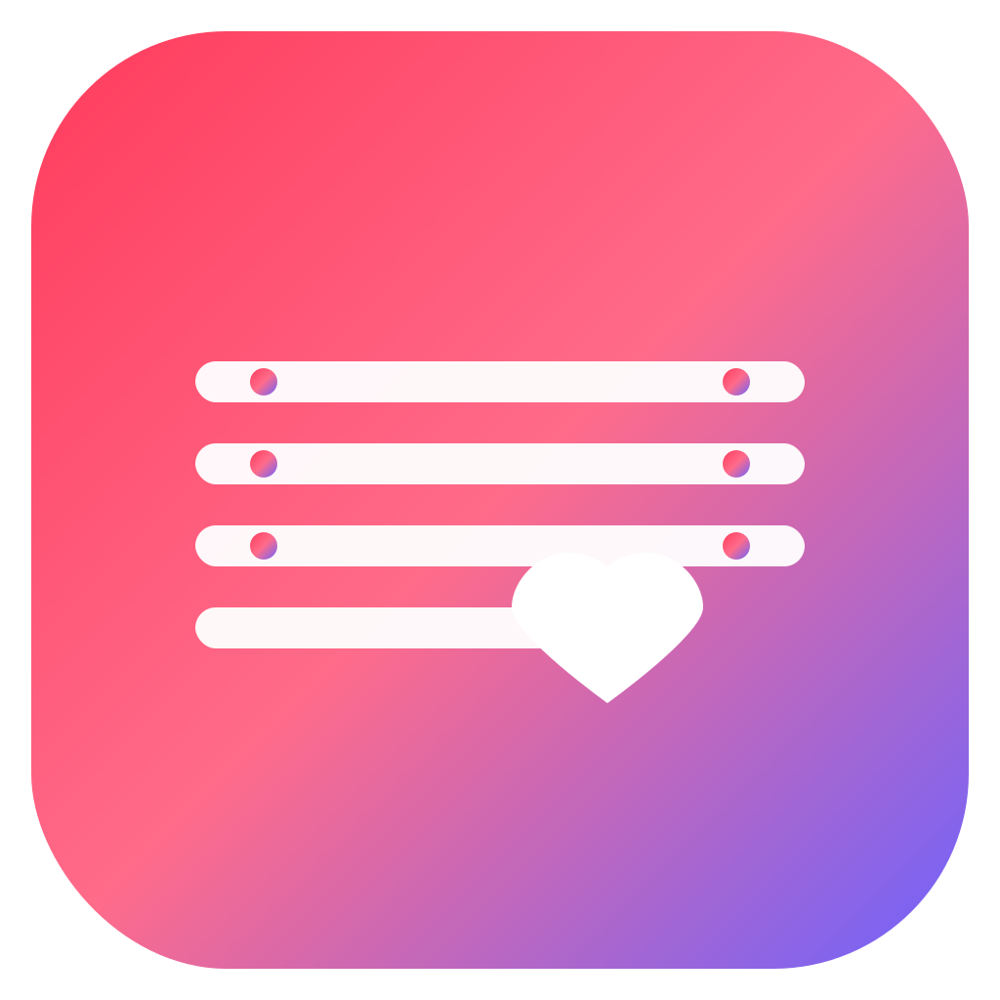

<div align="center">
  
</div>

# MovieMatchApp

Swipe-style movie recommendations on iOS—powered by content-based AI and a clean SwiftUI interface.

---

## 📸 App Video Demo

https://user-images.githubusercontent.com/jaineelmodi11/MovieMatchApp/main/docs/assets/App_video.mp4

*(Playable inline on GitHub via video attachment)*

---

## 📖 About

MovieMatchApp is an **iOS app** built in **Swift** with **SwiftUI + Combine**, featuring a Tinder‑style swipe interface. Users swipe right to like and left to pass on movie cards, and receive recommendations based solely on movie content embeddings.

Your backend consists of an **Express** proxy and a **Flask** ML service using Sentence‑Transformers (`all‑MiniLM‑L6‑v2`).

---

## ⭐ Key Features

- **Swipe Interface**  
  Browse movies one by one: swipe right to “Like,” left to “Pass.”

- **Content-Based Recommendation Engine**  
  Embeds movie overviews via a Sentence‑Transformers model and finds similar titles.

- **Firebase Authentication**  
  Email/password sign‑up & sign‑in via Firebase Auth.

- **Dark Mode Support**  
  Fully adapts to iOS system appearance.

- **Recsend CLI for Testing**  
  Developer-focused CLI for validating endpoints with YAML-defined requests.

---

## 🧰 Tech Stack

<p align="center">
  
  
  
  
  
  
  
  
  
  
</p>

- **iOS Client**  
  - **Language:** Swift 5.5  
  - **UI:** SwiftUI 2.0 + Combine  
  - **Networking:** URLSession / Foundation  
  - **Auth:** Firebase Email/Password

- **Backend API**  
  - **Express Proxy:** Node.js + Express + Axios to ML service  
  - **ML Service:** Python Flask + Sentence-Transformers `all-MiniLM-L6-v2`  
  - **Database:** PostgreSQL

---

## 🏗 Architecture & Flow

```text
 ┌──────────────────────────────────┐
 │       iOS Client                 │
 │  (SwiftUI + Combine)             │
 │ ┌──────────┐   ┌───────────┐     │
 │ │  View   │──▶│ ViewModel  │     │
 │ └──────────┘   └───────────┘     │
 │      ▲                │          │
 │      │      URLSession │          │
 │      │   ┌─────────────▼────────┐ │
 │      │   │  NetworkManager     │  │
 │      │   └─────────────┬────────┘ │
 │      │                 │          │
 │      └─────────────────▼────────┘ │
 │       Express Proxy (3000)        │
 └──────────────────────────────────┘
               ▲       │             
               │       │             
               │  Flask ML Service (5000)
               │                       
          PostgreSQL                   
```

---

## 🧪 Testing Content-Based Recommendations

1. **Start services**  
   - **Flask ML Service:**
     ```bash
     cd movie-backend
     source venv/bin/activate
     python service.py
     ```  
   - **Express Proxy:**
     ```bash
     cd movie-backend
     node server.js
     ```

2. **Run Recsend CLI:**
   ```bash
   cd recsend_tests
   recsend send -f users.yaml
   recsend send -f swipes.yaml
   recsend send -f content_recs.yaml
   ```

3. **Or via cURL:**
   ```bash
   curl http://localhost:3000/recommendations/content/1 | jq .
   ```

*README updated to reflect content-based only.*
