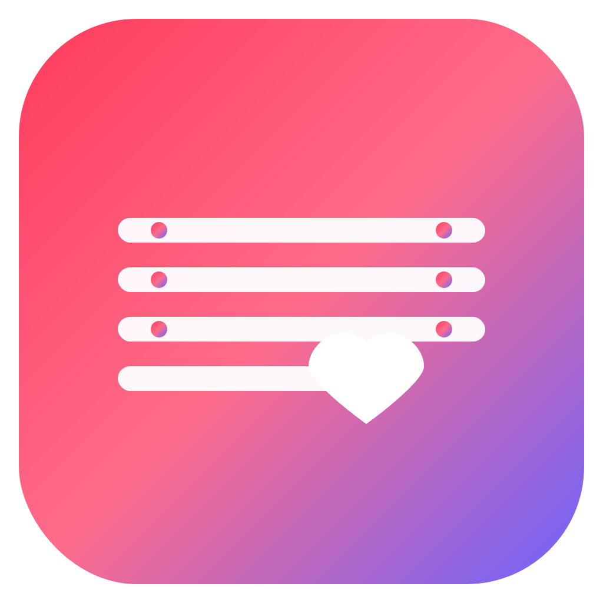
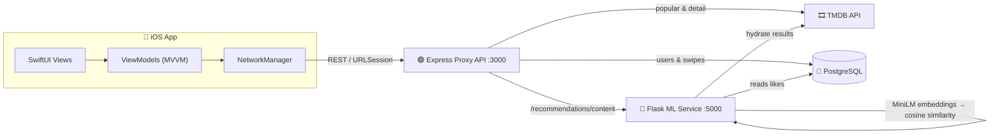

<div align="center">



# MovieMatch

**Swipe-to-discover movie recommendations on iOS — powered by a fine-tuned MiniLM content-based engine and a clean SwiftUI interface.**

[](https://github.com/jaineelmodi11/MovieMatchApp/actions/workflows/ci.yml)
[](LICENSE)


</div>

---

## 📖 Overview

MovieMatch turns movie discovery into a swipe. Like a film to teach the app your taste; pass to move on. Behind the simple interface, a fine-tuned **Sentence-Transformers (MiniLM)** model embeds movie overviews and ranks new titles by semantic similarity to what you've liked.

It's a full-stack project: a native **SwiftUI** client (MVVM + Combine), an **Express** proxy API, a **Flask** ML microservice, and **PostgreSQL** — all runnable with a single `docker compose up`. A **cross-platform [Flutter client](flutter_app/)** (iOS + Android) shares the same backend.

## ⭐ Features

- **Swipe interface** — browse movies one card at a time; right to like, left to pass, with haptics and fluid animations.
- **Content-based recommendations** — a SNLI/MNLI fine-tuned `all-MiniLM-L6-v2` model embeds overviews; cosine similarity against your liked titles surfaces what to watch next.
- **Rich movie detail** — synopsis, cast, ratings, and an embedded trailer (TMDB).
- **Firebase auth** — email/password sign-up and sign-in.
- **Configurable backend** — point the app at localhost or a deployed server via a single `Info.plist` value, no code changes.
- **Tested & CI-backed** — Jest/supertest API tests, a Python lint job, a Docker build, and end-to-end API contract tests driven by the companion **[recsend](https://github.com/jaineelmodi11/recsend-developer-focused-CLI)** CLI — all on GitHub Actions.

## 🏗 Architecture


```mermaid
flowchart LR
    subgraph Client["📱 iOS App"]
        V["SwiftUI Views"] --> VM["ViewModels (MVVM)"]
        VM --> NM["NetworkManager"]
    end

    NM -->|"REST / URLSession"| API["🟢 Express Proxy API :3000"]

    API -->|"popular & detail"| TMDB["🎞️ TMDB API"]
    API -->|"users & swipes"| DB[("🐘 PostgreSQL")]
    API -->|"/recommendations/content"| ML["🐍 Flask ML Service :5000"]

    ML -->|"reads likes"| DB
    ML -->|"MiniLM embeddings → cosine similarity"| ML
    ML -->|"hydrate results"| TMDB
```

**Flow:** the app sends swipes to the Express API, which records them in Postgres. When recommendations are requested, Express proxies to the Flask service, which embeds candidate movie overviews with the fine-tuned MiniLM model, scores them against the user's liked-movie vector, and returns the ranked list.

## 🧰 Tech Stack

| Layer | Tech |
|-------|------|
| **iOS client** | Swift 5.5, SwiftUI 2.0, Combine, URLSession, Firebase Auth |
| **Proxy API** | Node.js 18, Express, Axios |
| **ML service** | Python, Flask, Sentence-Transformers (`all-MiniLM-L6-v2`, SNLI/MNLI fine-tuned), scikit-learn |
| **Data** | PostgreSQL 16, TMDB API |
| **Tooling** | Docker Compose, GitHub Actions CI, [recsend](https://github.com/jaineelmodi11/recsend-developer-focused-CLI) (API testing) |

## 🚀 Quick Start

```bash
git clone --recurse-submodules https://github.com/jaineelmodi11/MovieMatchApp.git
cd MovieMatchApp

cp .env.example .env          # add your TMDB_API_KEY + a shared AI_SERVICE_KEY
docker compose up --build     # Postgres + Flask ML + Express API

curl http://localhost:3000/movies | head   # sanity check
```

Then open `MovieMatch.xcodeproj` in Xcode and run on the simulator. Full instructions (including pointing the app at a deployed backend) are in **[docs/RUNNING.md](docs/RUNNING.md)**.

## 🧪 Testing

API behaviour is validated two ways, both in CI:

- **Unit tests** — Jest + supertest cover the Express routes (`npm test` in `movie-backend/`).
- **Contract tests** — the companion **recsend** CLI runs YAML-defined requests with declarative assertions:

```yaml
# recsend_tests/users.yaml
url: http://localhost:3000/users/importOrGetId
method: POST
body: { firebaseUid: "test-uid-123", displayName: "Test User" }
expected:
  status_code: 200
  body_contains: [userId]
```

```bash
pip install "git+https://github.com/jaineelmodi11/recsend-developer-focused-CLI.git"
bash recsend_tests/run-tests.sh
```

## 📁 Project Structure

```
MovieMatch/            Native iOS app — SwiftUI (Views, ViewModels, Models, Services, Theme)
flutter_app/           Cross-platform client — Flutter (iOS + Android)
movie-backend/         Express proxy (server.js) + Flask ML service (service.py)
db/init.sql            PostgreSQL schema
docker-compose.yml     One-command full stack
recsend_tests/         API contract tests (recsend)
finetuned_embedding/   Fine-tuned MiniLM model (git submodule)
.github/workflows/     CI pipeline
```

## 🗺 Roadmap

- [x] Surface the hybrid (content + collaborative) recommender in-app
- [x] Watchlist / match-history screen backed by stored swipes
- [ ] Offline evaluation metrics (precision@k) in the README
- [x] **Cross-platform Flutter client (iOS + Android)** — see [`flutter_app/`](flutter_app/)
- [ ] Deployed public backend for a live demo

## 📄 License

MIT — see [LICENSE](LICENSE).
